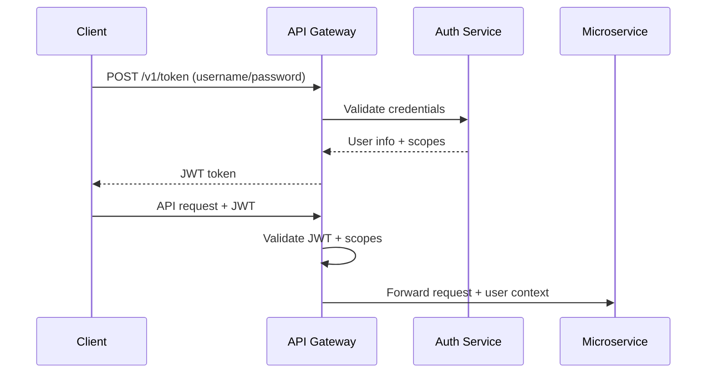

# ADR-002: OAuth2 JWT Authentication

**Status**: Accepted  
**Date**: 2024-01-01  
**Deciders**: Platform Team, Security Team  

## Context

Our chip quality platform requires secure authentication and authorization for:
- Manufacturing operators accessing the API
- Automated inspection stations
- External integrations and reporting systems
- Different permission levels (read-only, operator, admin)

We need a solution that provides:
- Stateless authentication for microservices
- Fine-grained authorization with scopes
- Integration with existing identity systems
- Support for both human users and service accounts
- Token expiration and refresh capabilities

## Decision

We will implement **OAuth2 with JWT bearer tokens** using the password flow for authentication, with scope-based authorization.

## Rationale

### Technical Architecture



### Implementation Details

```python
# JWT Token Structure
{
  "sub": "operator1",                    # Subject (username)
  "iss": "chip-quality-platform",       # Issuer
  "aud": "api",                          # Audience
  "exp": 1640995200,                     # Expiration timestamp
  "iat": 1640991600,                     # Issued at timestamp
  "scopes": [                            # Authorization scopes
    "inspections:read",
    "inspections:write",
    "reports:read"
  ],
  "role": "operator",                    # User role
  "station": "AOI-LINE-1"               # Optional context
}
```

### Scope Design

| Scope | Description | Typical Users |
|-------|-------------|---------------|
| `inspections:read` | View inspections | All users |
| `inspections:write` | Create/modify inspections | Operators, stations |
| `reports:read` | View reports | All users |
| `reports:write` | Generate reports | System services |
| `admin:*` | Administrative actions | Administrators |
| `metrics:read` | Access system metrics | Monitoring systems |

### Compared Alternatives

| Solution | Pros | Cons | Score |
|----------|------|------|-------|
| **OAuth2 + JWT** | ✅ Standard, stateless, scalable | ⚠️ Token management complexity | 9/10 |
| API Keys | ✅ Simple | ❌ No expiration, limited scopes | 5/10 |
| Session-based | ✅ Mature | ❌ Stateful, poor for microservices | 4/10 |
| mTLS | ✅ Strong security | ❌ Complex certificate management | 7/10 |
| OAuth2 + Opaque | ✅ Revocable | ❌ Requires token introspection | 6/10 |

## Implementation

### Token Generation

```python
from fastapi.security import OAuth2PasswordBearer, OAuth2PasswordRequestForm
import jwt
from datetime import datetime, timedelta

oauth2_scheme = OAuth2PasswordBearer(tokenUrl="/v1/token")

@app.post("/v1/token")
async def create_token(form_data: OAuth2PasswordRequestForm = Depends()):
    user = await authenticate_user(form_data.username, form_data.password)
    if not user:
        raise HTTPException(401, "Invalid credentials")
    
    # Generate JWT with user scopes
    payload = {
        "sub": user.username,
        "scopes": user.scopes,
        "role": user.role,
        "exp": datetime.utcnow() + timedelta(minutes=30),
        "iss": "chip-quality-platform"
    }
    
    token = jwt.encode(payload, SECRET_KEY, algorithm="HS256")
    return {"access_token": token, "token_type": "bearer"}
```

### Authorization Dependency

```python
from fastapi import Security, HTTPException, Depends
from typing import List

def require_scopes(required_scopes: List[str]):
    def dependency(token: str = Depends(oauth2_scheme)):
        try:
            payload = jwt.decode(token, SECRET_KEY, algorithms=["HS256"])
            token_scopes = set(payload.get("scopes", []))
            required_scopes_set = set(required_scopes)
            
            if not required_scopes_set.issubset(token_scopes):
                raise HTTPException(403, "Insufficient permissions")
                
            return payload
        except jwt.ExpiredSignatureError:
            raise HTTPException(401, "Token expired")
        except jwt.JWTError:
            raise HTTPException(401, "Invalid token")
    
    return dependency

# Usage in endpoints
@app.post("/v1/inspections")
async def create_inspection(
    data: InspectionCreate,
    user=Depends(require_scopes(["inspections:write"]))
):
    # user contains decoded JWT payload
    return await inspection_service.create(data, user_id=user["sub"])
```

## Security Considerations

### Token Security
- **Signing Algorithm**: HS256 for simplicity, RS256 for distributed systems
- **Secret Management**: Store JWT secret in Kubernetes secrets
- **Token Expiration**: 30-minute expiry to limit exposure
- **Refresh Tokens**: Optional for long-lived sessions

### Transport Security
- **HTTPS Only**: All token exchanges over TLS
- **Secure Headers**: Include security headers in responses
- **CORS**: Properly configured for web clients

### Threat Mitigation

| Threat | Mitigation |
|--------|------------|
| Token theft | Short expiration, HTTPS-only |
| Replay attacks | Timestamp validation, nonce (optional) |
| Privilege escalation | Scope validation on each request |
| Brute force | Rate limiting on token endpoint |
| Token injection | Signature verification |

## Configuration

### Environment Variables

```bash
# Required
JWT_SECRET_KEY=your-256-bit-secret
JWT_ALGORITHM=HS256
JWT_EXPIRE_MINUTES=30

# Optional
JWT_ISSUER=chip-quality-platform
JWT_AUDIENCE=api
ENABLE_TOKEN_REFRESH=false
```

### User Storage

```sql
-- Simple user table for demo/development
CREATE TABLE users (
    id UUID PRIMARY KEY,
    username VARCHAR(50) UNIQUE NOT NULL,
    password_hash VARCHAR(255) NOT NULL,  -- Argon2 hashed
    role VARCHAR(20) NOT NULL DEFAULT 'operator',
    scopes TEXT[] NOT NULL DEFAULT ARRAY['inspections:read'],
    active BOOLEAN NOT NULL DEFAULT true,
    created_at TIMESTAMPTZ DEFAULT now(),
    last_login TIMESTAMPTZ
);

-- Example scopes by role
INSERT INTO users (username, password_hash, role, scopes) VALUES
('operator1', '$argon2id$...', 'operator', ARRAY['inspections:read', 'inspections:write', 'reports:read']),
('admin', '$argon2id$...', 'admin', ARRAY['admin:*']),
('station-aoi-1', '$argon2id$...', 'station', ARRAY['inspections:write']);
```

## Testing Strategy

### Unit Tests
```python
def test_token_generation():
    user = User(username="test", scopes=["inspections:read"])
    token = generate_token(user)
    payload = decode_token(token)
    assert payload["sub"] == "test"
    assert "inspections:read" in payload["scopes"]

def test_scope_validation():
    # Test insufficient scopes
    with pytest.raises(HTTPException) as exc:
        require_scopes(["admin:write"])(token_with_read_only_scopes)
    assert exc.value.status_code == 403
```

### Integration Tests
```python
async def test_protected_endpoint():
    # Without token
    response = await client.post("/v1/inspections", json=data)
    assert response.status_code == 401
    
    # With valid token
    token = await get_test_token(scopes=["inspections:write"])
    response = await client.post(
        "/v1/inspections", 
        json=data,
        headers={"Authorization": f"Bearer {token}"}
    )
    assert response.status_code == 201
```

## Consequences

### Positive
- **Stateless**: No server-side session storage required
- **Scalable**: Works seamlessly across microservices
- **Standard**: Industry-standard OAuth2 implementation
- **Flexible**: Scope-based permissions support various use cases
- **Debuggable**: JWT contents are inspectable (base64 encoded)

### Negative
- **Token Size**: JWTs are larger than opaque tokens
- **Revocation**: Cannot revoke tokens before expiration
- **Clock Sync**: Requires synchronized clocks for expiration
- **Secret Management**: JWT secret must be shared across services

### Mitigation Strategies
- Keep token payloads minimal to reduce size
- Use short expiration times (30 minutes) to limit exposure
- Implement token blacklisting for critical revocation needs
- Use NTP for clock synchronization in production
- Consider moving to RS256 with key rotation for larger deployments

## Migration Path

### Phase 1: Basic Implementation
- Implement OAuth2 password flow
- Add JWT validation to API Gateway
- Create basic user/scope management

### Phase 2: Enhanced Security
- Add refresh token support
- Implement rate limiting on auth endpoints
- Add audit logging for authentication events

### Phase 3: Enterprise Integration
- LDAP/SAML integration for existing identity systems
- RS256 with key rotation
- Advanced scope hierarchy

## Related ADRs
- [ADR-001: FastAPI Framework](0001-framework-fastapi.md)
- [ADR-003: Idempotency Keys](0003-idempotency-keys.md)
- [ADR-007: Observability Stack](0007-observability-otel-prometheus-loki.md)

## References
- [RFC 6749: OAuth2 Authorization Framework](https://tools.ietf.org/html/rfc6749)
- [RFC 7519: JSON Web Token (JWT)](https://tools.ietf.org/html/rfc7519)
- [FastAPI Security Documentation](https://fastapi.tiangolo.com/tutorial/security/)
- [OWASP JWT Security Cheat Sheet](https://cheatsheetseries.owasp.org/cheatsheets/JSON_Web_Token_for_Java_Cheat_Sheet.html)