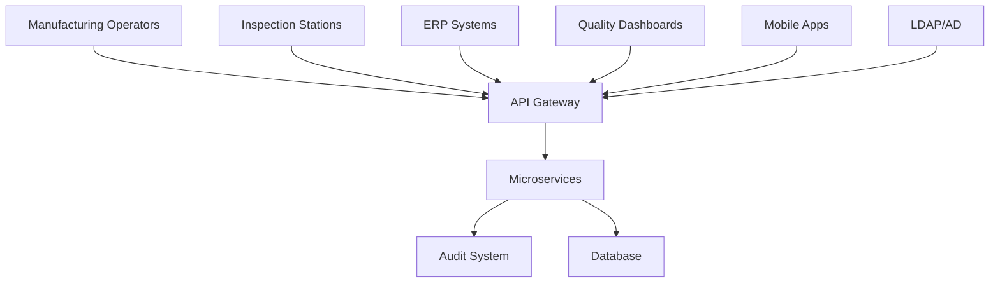
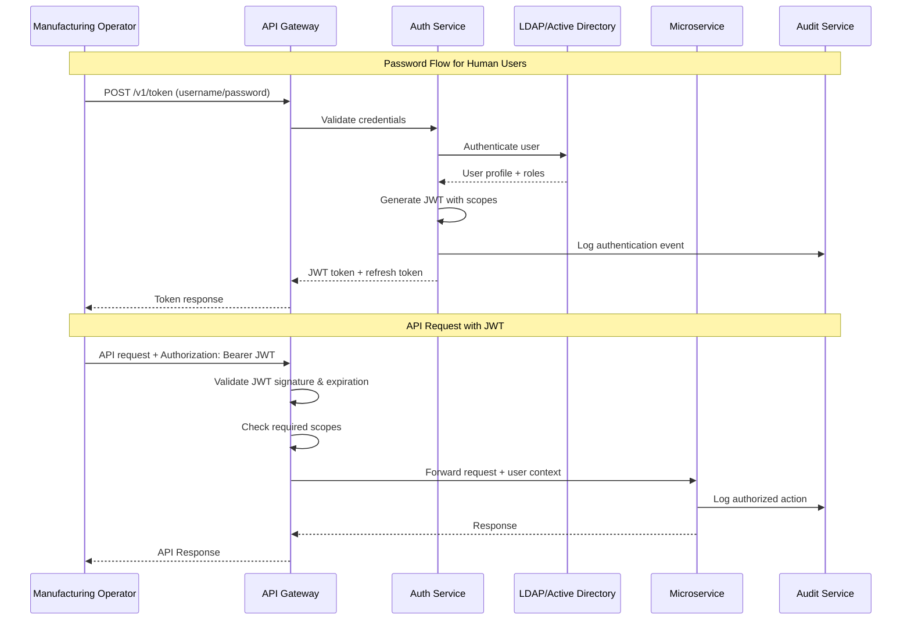

# ADR-002: OAuth2 JWT Authentication & Authorization

**Status**: ✅ Accepted  
**Date**: 2025-10-30  
**Deciders**: Platform Team, Security Team, Architecture Team  
**Consultants**: CISO, Manufacturing Security Lead  
**Review Date**: 2026-04-30  
**Compliance**: FDA 21 CFR Part 11, ISO 27001, SOC 2 Type II  

## 📋 Executive Summary

We have selected **OAuth2 with JWT bearer tokens** as the authentication and authorization mechanism for the chip quality manufacturing platform. This decision prioritizes scalability, security, and compliance with manufacturing industry standards while supporting both human operators and automated systems.

## 🎯 Context and Problem Statement

### Business Requirements

#### Manufacturing Environment Constraints
- **24/7 Operations**: Continuous manufacturing with shift changes
- **Multi-tenant Access**: Different companies, departments, and contractors
- **Compliance**: FDA 21 CFR Part 11 electronic signatures and audit trails
- **Station Authentication**: 1000+ automated inspection stations
- **Integration**: ERP, MES, and third-party quality systems

#### Security Requirements


#### Performance Constraints
- **Latency**: <10ms token validation time
- **Throughput**: 100,000+ authentications per hour during peak
- **Availability**: 99.99% authentication service uptime
- **Scalability**: Support for 10,000 concurrent users

### Technical Requirements

#### Authentication Flows
1. **Password Flow**: Human operators with username/password
2. **Client Credentials**: Automated systems and service accounts
3. **Refresh Token Flow**: Long-lived sessions with token renewal
4. **Device Flow**: Mobile and embedded devices

#### Authorization Model
- **Role-Based Access Control (RBAC)**: Hierarchical role assignments
- **Attribute-Based Access Control (ABAC)**: Context-aware permissions
- **Scope-Based Permissions**: Fine-grained API access control
- **Station-Level Isolation**: Operators limited to assigned stations

## 🏆 Decision

We will implement **OAuth2 with JWT bearer tokens** using multiple flows based on client type, with scope-based authorization and comprehensive audit logging.

### Core Architecture



### Production JWT Structure

```json
{
  "header": {
    "alg": "RS256",
    "typ": "JWT",
    "kid": "manufacturing-platform-2025"
  },
  "payload": {
    "sub": "john.doe",
    "iss": "https://auth.manufacturing.company.com",
    "aud": "chip-quality-platform",
    "exp": 1698580800,
    "iat": 1698577200,
    "nbf": 1698577200,
    "jti": "550e8400-e29b-41d4-a716-446655440000",
    "scopes": [
      "inspections:read",
      "inspections:write",
      "artifacts:read",
      "reports:read"
    ],
    "role": "quality_operator",
    "department": "quality_assurance",
    "stations": ["AOI-LINE-1", "AOI-LINE-2"],
    "shift": "morning",
    "employee_id": "EMP001234",
    "session_id": "sess_abc123def456",
    "ip_whitelist": ["10.0.1.0/24", "10.0.2.0/24"],
    "compliance": {
      "cfr_part_11": true,
      "requires_digital_signature": false
    }
  }
}
```

## 🔐 Comprehensive Security Implementation

### 1. Token Generation with Enterprise Features

```python
import jwt
import secrets
from datetime import datetime, timedelta
from typing import List, Dict, Any, Optional
from cryptography.hazmat.primitives import serialization
from cryptography.hazmat.primitives.asymmetric import rsa
import redis
import hashlib

class JWTManager:
    def __init__(self, redis_client: redis.Redis):
        self.redis_client = redis_client
        self.private_key = self._load_private_key()
        self.public_key = self._load_public_key()
        self.algorithm = "RS256"
        self.issuer = "https://auth.manufacturing.company.com"
        
    def _load_private_key(self):
        """Load RSA private key from secure storage."""
        with open("/etc/ssl/private/jwt-signing-key.pem", "rb") as key_file:
            return serialization.load_pem_private_key(
                key_file.read(),
                password=None,
            )
    
    def _load_public_key(self):
        """Load RSA public key for verification."""
        with open("/etc/ssl/certs/jwt-public-key.pem", "rb") as key_file:
            return serialization.load_pem_public_key(key_file.read())
    
    async def generate_token_pair(
        self,
        user: User,
        client_ip: str,
        user_agent: str,
        scopes: List[str],
        session_metadata: Dict[str, Any]
    ) -> Dict[str, Any]:
        """Generate access and refresh token pair with security controls."""
        
        # Generate unique identifiers
        session_id = f"sess_{secrets.token_urlsafe(16)}"
        jti = secrets.token_urlsafe(32)
        refresh_jti = secrets.token_urlsafe(32)
        
        # Access token payload
        now = datetime.utcnow()
        access_payload = {
            "sub": user.username,
            "iss": self.issuer,
            "aud": "chip-quality-platform",
            "exp": now + timedelta(minutes=30),  # Short-lived access token
            "iat": now,
            "nbf": now,
            "jti": jti,
            "session_id": session_id,
            "scopes": scopes,
            "role": user.role,
            "department": user.department,
            "stations": user.assigned_stations,
            "employee_id": user.employee_id,
            "ip_address": client_ip,
            "user_agent_hash": hashlib.sha256(user_agent.encode()).hexdigest()[:16],
            "compliance": {
                "cfr_part_11": user.requires_cfr_compliance,
                "requires_digital_signature": user.requires_digital_signature
            }
        }
        
        # Refresh token payload
        refresh_payload = {
            "sub": user.username,
            "iss": self.issuer,
            "aud": "chip-quality-platform-refresh",
            "exp": now + timedelta(days=7),  # Longer-lived refresh token
            "iat": now,
            "jti": refresh_jti,
            "session_id": session_id,
            "token_type": "refresh"
        }
        
        # Generate tokens
        access_token = jwt.encode(
            access_payload, 
            self.private_key, 
            algorithm=self.algorithm,
            headers={"kid": "manufacturing-platform-2025"}
        )
        
        refresh_token = jwt.encode(
            refresh_payload,
            self.private_key,
            algorithm=self.algorithm
        )
        
        # Store session metadata in Redis
        session_data = {
            "user_id": user.id,
            "username": user.username,
            "session_id": session_id,
            "access_jti": jti,
            "refresh_jti": refresh_jti,
            "client_ip": client_ip,
            "user_agent": user_agent,
            "created_at": now.isoformat(),
            "last_activity": now.isoformat(),
            "scopes": scopes,
            "metadata": session_metadata
        }
        
        # Store with expiration
        await self.redis_client.setex(
            f"session:{session_id}",
            timedelta(days=7).total_seconds(),
            json.dumps(session_data)
        )
        
        # Store JTI for blacklisting capabilities
        await self.redis_client.setex(
            f"jti:{jti}",
            timedelta(minutes=35).total_seconds(),  # Slightly longer than token exp
            "active"
        )
        
        return {
            "access_token": access_token,
            "refresh_token": refresh_token,
            "token_type": "bearer",
            "expires_in": 1800,  # 30 minutes
            "scope": " ".join(scopes),
            "session_id": session_id
        }

    async def validate_token(
        self,
        token: str,
        required_scopes: List[str] = None,
        client_ip: str = None
    ) -> Dict[str, Any]:
        """Comprehensive token validation with security checks."""
        
        try:
            # Decode and verify signature
            payload = jwt.decode(
                token,
                self.public_key,
                algorithms=[self.algorithm],
                audience="chip-quality-platform",
                issuer=self.issuer
            )
            
            # Check if token is blacklisted
            jti = payload.get("jti")
            if jti:
                is_blacklisted = await self.redis_client.get(f"blacklist:{jti}")
                if is_blacklisted:
                    raise jwt.InvalidTokenError("Token has been revoked")
            
            # Validate session exists
            session_id = payload.get("session_id")
            if session_id:
                session_data = await self.redis_client.get(f"session:{session_id}")
                if not session_data:
                    raise jwt.InvalidTokenError("Session not found or expired")
            
            # IP address validation (if configured)
            if client_ip and payload.get("ip_address"):
                if not self._validate_ip_access(client_ip, payload.get("ip_whitelist", [])):
                    raise jwt.InvalidTokenError("IP address not authorized")
            
            # Scope validation
            if required_scopes:
                token_scopes = set(payload.get("scopes", []))
                required_scopes_set = set(required_scopes)
                if not required_scopes_set.issubset(token_scopes):
                    missing_scopes = required_scopes_set - token_scopes
                    raise jwt.InvalidTokenError(f"Missing required scopes: {missing_scopes}")
            
            # Update last activity
            if session_id:
                await self._update_session_activity(session_id)
            
            return payload
            
        except jwt.ExpiredSignatureError:
            raise jwt.InvalidTokenError("Token has expired")
        except jwt.InvalidAudienceError:
            raise jwt.InvalidTokenError("Invalid token audience")
        except jwt.InvalidIssuerError:
            raise jwt.InvalidTokenError("Invalid token issuer")
        except jwt.InvalidSignatureError:
            raise jwt.InvalidTokenError("Invalid token signature")
        except Exception as e:
            raise jwt.InvalidTokenError(f"Token validation failed: {str(e)}")
```

### 2. Comprehensive Scope Management

```python
from enum import Enum
from typing import Set, Dict, List
from dataclasses import dataclass

class Permission(str, Enum):
    # Inspection permissions
    INSPECTIONS_READ = "inspections:read"
    INSPECTIONS_WRITE = "inspections:write"
    INSPECTIONS_DELETE = "inspections:delete"
    INSPECTIONS_ADMIN = "inspections:admin"
    
    # Artifact permissions
    ARTIFACTS_READ = "artifacts:read"
    ARTIFACTS_WRITE = "artifacts:write"
    ARTIFACTS_DELETE = "artifacts:delete"
    
    # Inference permissions
    INFERENCE_EXECUTE = "inference:execute"
    INFERENCE_READ = "inference:read"
    INFERENCE_ADMIN = "inference:admin"
    
    # Report permissions
    REPORTS_READ = "reports:read"
    REPORTS_WRITE = "reports:write"
    REPORTS_ADMIN = "reports:admin"
    
    # Administrative permissions
    ADMIN_USERS = "admin:users"
    ADMIN_STATIONS = "admin:stations"
    ADMIN_SYSTEM = "admin:system"
    ADMIN_SECURITY = "admin:security"
    
    # Compliance permissions
    COMPLIANCE_READ = "compliance:read"
    COMPLIANCE_WRITE = "compliance:write"
    COMPLIANCE_AUDIT = "compliance:audit"

@dataclass
class RoleDefinition:
    name: str
    permissions: Set[Permission]
    description: str
    max_session_duration: timedelta
    requires_mfa: bool = False
    station_isolation: bool = False

# Production role definitions
PRODUCTION_ROLES = {
    "manufacturing_operator": RoleDefinition(
        name="Manufacturing Operator",
        permissions={
            Permission.INSPECTIONS_READ,
            Permission.INSPECTIONS_WRITE,
            Permission.ARTIFACTS_READ,
            Permission.ARTIFACTS_WRITE,
            Permission.REPORTS_READ,
            Permission.INFERENCE_EXECUTE
        },
        description="Front-line operators managing daily inspections",
        max_session_duration=timedelta(hours=8),
        station_isolation=True
    ),
    
    "quality_engineer": RoleDefinition(
        name="Quality Engineer",
        permissions={
            Permission.INSPECTIONS_READ,
            Permission.INSPECTIONS_WRITE,
            Permission.INSPECTIONS_DELETE,
            Permission.ARTIFACTS_READ,
            Permission.ARTIFACTS_WRITE,
            Permission.INFERENCE_EXECUTE,
            Permission.INFERENCE_READ,
            Permission.REPORTS_READ,
            Permission.REPORTS_WRITE,
            Permission.COMPLIANCE_READ
        },
        description="Quality engineers with broad inspection authority",
        max_session_duration=timedelta(hours=12),
        requires_mfa=True
    ),
    
    "quality_manager": RoleDefinition(
        name="Quality Manager",
        permissions={
            Permission.INSPECTIONS_READ,
            Permission.INSPECTIONS_ADMIN,
            Permission.ARTIFACTS_READ,
            Permission.INFERENCE_READ,
            Permission.INFERENCE_ADMIN,
            Permission.REPORTS_READ,
            Permission.REPORTS_WRITE,
            Permission.REPORTS_ADMIN,
            Permission.COMPLIANCE_READ,
            Permission.COMPLIANCE_WRITE,
            Permission.ADMIN_STATIONS
        },
        description="Quality management with administrative oversight",
        max_session_duration=timedelta(hours=10),
        requires_mfa=True
    ),
    
    "system_admin": RoleDefinition(
        name="System Administrator",
        permissions=set(Permission),  # All permissions
        description="Full system administration access",
        max_session_duration=timedelta(hours=4),
        requires_mfa=True
    ),
    
    "inspection_station": RoleDefinition(
        name="Automated Inspection Station",
        permissions={
            Permission.INSPECTIONS_READ,
            Permission.INSPECTIONS_WRITE,
            Permission.ARTIFACTS_WRITE,
            Permission.INFERENCE_EXECUTE
        },
        description="Automated inspection stations",
        max_session_duration=timedelta(days=30),  # Long-lived for automation
        station_isolation=True
    ),
    
    "readonly_reporting": RoleDefinition(
        name="Read-Only Reporting",
        permissions={
            Permission.INSPECTIONS_READ,
            Permission.ARTIFACTS_READ,
            Permission.REPORTS_READ
        },
        description="External systems with read-only access",
        max_session_duration=timedelta(hours=24)
    )
}

class ScopeValidator:
    """Advanced scope validation with hierarchical permissions."""
    
    def __init__(self):
        self.role_hierarchy = {
            "system_admin": ["quality_manager", "quality_engineer", "manufacturing_operator"],
            "quality_manager": ["quality_engineer", "manufacturing_operator"],
            "quality_engineer": ["manufacturing_operator"]
        }
    
    def validate_scopes(
        self,
        user_role: str,
        requested_scopes: List[str],
        context: Dict[str, Any] = None
    ) -> List[str]:
        """Validate and filter scopes based on role and context."""
        
        role_def = PRODUCTION_ROLES.get(user_role)
        if not role_def:
            raise ValueError(f"Unknown role: {user_role}")
        
        # Get all permissions for role (including inherited)
        available_permissions = self._get_effective_permissions(user_role)
        
        # Filter requested scopes
        granted_scopes = []
        for scope in requested_scopes:
            try:
                permission = Permission(scope)
                if permission in available_permissions:
                    # Additional context-based validation
                    if self._validate_context_permission(permission, context):
                        granted_scopes.append(scope)
            except ValueError:
                # Skip unknown scopes
                continue
        
        return granted_scopes
    
    def _get_effective_permissions(self, role: str) -> Set[Permission]:
        """Get all permissions including inherited ones."""
        permissions = set()
        
        # Add direct permissions
        if role in PRODUCTION_ROLES:
            permissions.update(PRODUCTION_ROLES[role].permissions)
        
        # Add inherited permissions
        for parent_role in self.role_hierarchy.get(role, []):
            if parent_role in PRODUCTION_ROLES:
                permissions.update(PRODUCTION_ROLES[parent_role].permissions)
        
        return permissions
    
    def _validate_context_permission(
        self,
        permission: Permission,
        context: Dict[str, Any]
    ) -> bool:
        """Context-aware permission validation."""
        
        if not context:
            return True
        
        # Station isolation for operators
        if context.get("station_isolation") and "station_id" in context:
            user_stations = context.get("user_stations", [])
            requested_station = context.get("station_id")
            if requested_station and requested_station not in user_stations:
                return False
        
        # Time-based restrictions
        if context.get("requires_business_hours"):
            current_hour = datetime.now().hour
            if not (7 <= current_hour <= 18):  # 7 AM to 6 PM
                return False
        
        return True
```

### 3. Advanced Authentication Flows

```python
from fastapi import Depends, HTTPException, status
from fastapi.security import OAuth2PasswordBearer, OAuth2PasswordRequestForm
import asyncio
from typing import Optional, Dict, Any

oauth2_scheme = OAuth2PasswordBearer(
    tokenUrl="/v1/auth/token",
    scopes={
        "inspections:read": "View inspection data",
        "inspections:write": "Create and modify inspections",
        "artifacts:read": "Download inspection artifacts",
        "artifacts:write": "Upload inspection artifacts",
        "inference:execute": "Trigger ML inference operations",
        "reports:read": "Access quality reports",
        "reports:write": "Generate custom reports",
        "admin:users": "Manage user accounts",
        "admin:system": "System administration"
    }
)

class AuthenticationService:
    def __init__(
        self,
        jwt_manager: JWTManager,
        ldap_client: LDAPClient,
        audit_service: AuditService,
        mfa_service: MFAService
    ):
        self.jwt_manager = jwt_manager
        self.ldap_client = ldap_client
        self.audit_service = audit_service
        self.mfa_service = mfa_service
        self.scope_validator = ScopeValidator()
    
    async def authenticate_password_flow(
        self,
        form_data: OAuth2PasswordRequestForm,
        client_ip: str,
        user_agent: str,
        device_fingerprint: Optional[str] = None
    ) -> Dict[str, Any]:
        """OAuth2 Password Flow with enhanced security."""
        
        # Rate limiting check
        await self._check_rate_limit(form_data.username, client_ip)
        
        try:
            # Authenticate against LDAP/AD
            user = await self.ldap_client.authenticate(
                form_data.username,
                form_data.password
            )
            
            if not user:
                await self._log_failed_authentication(
                    form_data.username, client_ip, "invalid_credentials"
                )
                raise HTTPException(
                    status_code=status.HTTP_401_UNAUTHORIZED,
                    detail="Invalid credentials"
                )
            
            # Check if user is active
            if not user.is_active:
                await self._log_failed_authentication(
                    form_data.username, client_ip, "account_disabled"
                )
                raise HTTPException(
                    status_code=status.HTTP_401_UNAUTHORIZED,
                    detail="Account disabled"
                )
            
            # MFA check for privileged roles
            role_def = PRODUCTION_ROLES.get(user.role)
            if role_def and role_def.requires_mfa:
                # Initiate MFA flow
                mfa_challenge = await self.mfa_service.create_challenge(
                    user.id, client_ip
                )
                return {
                    "requires_mfa": True,
                    "challenge_id": mfa_challenge.id,
                    "challenge_type": mfa_challenge.type,
                    "message": "MFA verification required"
                }
            
            # Validate and filter scopes
            requested_scopes = form_data.scopes or []
            granted_scopes = self.scope_validator.validate_scopes(
                user.role,
                requested_scopes,
                context={
                    "user_stations": user.assigned_stations,
                    "station_isolation": role_def.station_isolation if role_def else False
                }
            )
            
            # Generate token pair
            tokens = await self.jwt_manager.generate_token_pair(
                user=user,
                client_ip=client_ip,
                user_agent=user_agent,
                scopes=granted_scopes,
                session_metadata={
                    "device_fingerprint": device_fingerprint,
                    "authentication_method": "password",
                    "mfa_verified": False
                }
            )
            
            # Log successful authentication
            await self.audit_service.log_authentication(
                user_id=user.id,
                username=user.username,
                client_ip=client_ip,
                user_agent=user_agent,
                scopes=granted_scopes,
                success=True
            )
            
            return tokens
            
        except Exception as e:
            await self._log_failed_authentication(
                form_data.username, client_ip, str(e)
            )
            raise
    
    async def authenticate_client_credentials(
        self,
        client_id: str,
        client_secret: str,
        scopes: List[str],
        client_ip: str
    ) -> Dict[str, Any]:
        """OAuth2 Client Credentials Flow for service accounts."""
        
        # Validate client credentials
        service_account = await self._validate_service_account(
            client_id, client_secret
        )
        
        if not service_account:
            raise HTTPException(
                status_code=status.HTTP_401_UNAUTHORIZED,
                detail="Invalid client credentials"
            )
        
        # Validate requested scopes against service account permissions
        granted_scopes = self.scope_validator.validate_scopes(
            service_account.role,
            scopes
        )
        
        # Generate access token (no refresh token for client credentials)
        access_token = await self.jwt_manager.generate_service_token(
            service_account=service_account,
            client_ip=client_ip,
            scopes=granted_scopes
        )
        
        return {
            "access_token": access_token,
            "token_type": "bearer",
            "expires_in": 3600,  # 1 hour for service accounts
            "scope": " ".join(granted_scopes)
        }
```

### 4. Comprehensive Audit Logging

```python
from dataclasses import dataclass
from typing import Optional, Dict, Any
import json
from datetime import datetime

@dataclass
class AuditEvent:
    event_type: str
    user_id: Optional[str]
    username: Optional[str]
    client_ip: str
    user_agent: str
    resource: Optional[str]
    action: str
    success: bool
    details: Dict[str, Any]
    timestamp: datetime
    session_id: Optional[str]
    correlation_id: Optional[str]

class AuditService:
    """Comprehensive audit logging for compliance."""
    
    def __init__(self, database: AsyncSession, kafka_producer: KafkaProducer):
        self.db = database
        self.kafka_producer = kafka_producer
    
    async def log_authentication(
        self,
        user_id: Optional[str],
        username: str,
        client_ip: str,
        user_agent: str,
        scopes: List[str],
        success: bool,
        failure_reason: Optional[str] = None,
        session_id: Optional[str] = None
    ):
        """Log authentication events for security monitoring."""
        
        event = AuditEvent(
            event_type="authentication",
            user_id=user_id,
            username=username,
            client_ip=client_ip,
            user_agent=user_agent,
            resource="auth_service",
            action="login",
            success=success,
            details={
                "scopes": scopes,
                "failure_reason": failure_reason,
                "authentication_method": "oauth2_password"
            },
            timestamp=datetime.utcnow(),
            session_id=session_id,
            correlation_id=None
        )
        
        await self._persist_audit_event(event)
        await self._publish_security_event(event)
    
    async def log_authorization(
        self,
        user_id: str,
        username: str,
        resource: str,
        action: str,
        required_scopes: List[str],
        granted_scopes: List[str],
        success: bool,
        client_ip: str,
        session_id: str,
        correlation_id: Optional[str] = None
    ):
        """Log authorization decisions for compliance auditing."""
        
        event = AuditEvent(
            event_type="authorization",
            user_id=user_id,
            username=username,
            client_ip=client_ip,
            user_agent="",
            resource=resource,
            action=action,
            success=success,
            details={
                "required_scopes": required_scopes,
                "granted_scopes": granted_scopes,
                "scope_check_passed": success
            },
            timestamp=datetime.utcnow(),
            session_id=session_id,
            correlation_id=correlation_id
        )
        
        await self._persist_audit_event(event)
    
    async def _persist_audit_event(self, event: AuditEvent):
        """Store audit event in database for long-term retention."""
        
        audit_record = AuditLog(
            event_type=event.event_type,
            user_id=event.user_id,
            username=event.username,
            client_ip=event.client_ip,
            user_agent=event.user_agent,
            resource=event.resource,
            action=event.action,
            success=event.success,
            details=event.details,
            timestamp=event.timestamp,
            session_id=event.session_id,
            correlation_id=event.correlation_id
        )
        
        self.db.add(audit_record)
        await self.db.commit()
    
    async def _publish_security_event(self, event: AuditEvent):
        """Publish security events to SIEM systems."""
        
        if event.event_type == "authentication" and not event.success:
            # Publish failed authentication for real-time monitoring
            await self.kafka_producer.send(
                topic="security.authentication.failed",
                key=event.username,
                value=json.dumps({
                    "username": event.username,
                    "client_ip": event.client_ip,
                    "timestamp": event.timestamp.isoformat(),
                    "details": event.details
                })
            )
```

## 📊 Production Deployment Configuration

### Environment Configuration

```yaml
# Production authentication configuration
authentication:
  jwt:
    algorithm: "RS256"
    issuer: "https://auth.manufacturing.company.com"
    audience: "chip-quality-platform"
    access_token_expire_minutes: 30
    refresh_token_expire_days: 7
    key_rotation_days: 90
    
  oauth2:
    password_flow_enabled: true
    client_credentials_flow_enabled: true
    refresh_token_flow_enabled: true
    device_flow_enabled: false
    
  security:
    require_https: true
    rate_limit_enabled: true
    max_login_attempts: 5
    lockout_duration_minutes: 15
    session_timeout_minutes: 480  # 8 hours
    
  ldap:
    server: "ldaps://ldap.company.com:636"
    base_dn: "ou=manufacturing,dc=company,dc=com"
    bind_dn: "cn=chip-quality-service,ou=service-accounts,dc=company,dc=com"
    search_filter: "(sAMAccountName={username})"
    connection_pool_size: 10
    
  mfa:
    enabled: true
    providers: ["totp", "sms", "push"]
    required_for_roles: ["quality_manager", "system_admin"]
    backup_codes_enabled: true
    
  compliance:
    cfr_part_11_enabled: true
    audit_retention_days: 2555  # 7 years
    digital_signature_required: false
    password_policy_enforced: true
```

### Kubernetes Deployment

```yaml
# Auth service deployment
apiVersion: apps/v1
kind: Deployment
metadata:
  name: auth-service
  namespace: chip-quality
spec:
  replicas: 3
  selector:
    matchLabels:
      app: auth-service
  template:
    metadata:
      labels:
        app: auth-service
    spec:
      containers:
      - name: auth-service
        image: chip-quality/auth-service:latest
        ports:
        - containerPort: 8000
        env:
        - name: JWT_PRIVATE_KEY_PATH
          value: /etc/ssl/private/jwt-signing-key.pem
        - name: JWT_PUBLIC_KEY_PATH
          value: /etc/ssl/certs/jwt-public-key.pem
        - name: LDAP_BIND_PASSWORD
          valueFrom:
            secretKeyRef:
              name: ldap-credentials
              key: bind-password
        volumeMounts:
        - name: jwt-keys
          mountPath: /etc/ssl/private
          readOnly: true
        - name: jwt-public-keys
          mountPath: /etc/ssl/certs
          readOnly: true
        resources:
          requests:
            memory: "256Mi"
            cpu: "200m"
          limits:
            memory: "512Mi"
            cpu: "500m"
        livenessProbe:
          httpGet:
            path: /health
            port: 8000
          initialDelaySeconds: 30
          periodSeconds: 10
        readinessProbe:
          httpGet:
            path: /ready
            port: 8000
          initialDelaySeconds: 5
          periodSeconds: 5
      volumes:
      - name: jwt-keys
        secret:
          secretName: jwt-private-keys
          defaultMode: 0400
      - name: jwt-public-keys
        secret:
          secretName: jwt-public-keys
          defaultMode: 0444
```

## ⚖️ Alternative Analysis & Risk Assessment

### Comprehensive Security Comparison

| Solution | Security | Scalability | Compliance | Complexity | Total Score |
|----------|----------|-------------|------------|------------|-------------|
| **OAuth2 + JWT (RS256)** | 95 | 95 | 90 | 70 | **87.5** |
| OAuth2 + Opaque Tokens | 90 | 70 | 85 | 80 | 81.25 |
| mTLS Only | 100 | 60 | 80 | 85 | 81.25 |
| API Keys | 40 | 85 | 30 | 90 | 61.25 |
| SAML 2.0 | 85 | 50 | 95 | 60 | 72.5 |
| Session-based | 70 | 30 | 70 | 95 | 66.25 |

### Risk Mitigation Matrix

| Risk Category | Risk | Probability | Impact | Mitigation |
|---------------|------|-------------|--------|------------|
| **Token Security** | JWT compromise | Low | High | Short expiration, key rotation, blacklisting |
| **Performance** | Validation latency | Medium | Medium | Redis caching, optimized validation |
| **Availability** | Auth service failure | Low | Critical | Multi-region deployment, circuit breakers |
| **Compliance** | Audit trail gaps | Low | High | Comprehensive logging, immutable storage |
| **Integration** | LDAP connectivity | Medium | High | Connection pooling, fallback mechanisms |

## ✅ Success Metrics & Monitoring

### Security KPIs

```python
# Prometheus metrics for authentication monitoring
from prometheus_client import Counter, Histogram, Gauge

auth_attempts_total = Counter(
    'auth_attempts_total',
    'Total authentication attempts',
    ['username', 'client_ip', 'result', 'method']
)

auth_latency = Histogram(
    'auth_duration_seconds',
    'Authentication request duration',
    ['method', 'result'],
    buckets=[0.01, 0.05, 0.1, 0.25, 0.5, 1.0, 2.5, 5.0]
)

active_sessions = Gauge(
    'active_sessions_count',
    'Number of active user sessions',
    ['role', 'department']
)

token_validations_total = Counter(
    'token_validations_total',
    'Total token validation attempts',
    ['result', 'reason']
)

mfa_challenges_total = Counter(
    'mfa_challenges_total',
    'Total MFA challenges',
    ['method', 'result']
)
```

### Performance Targets

- **Authentication Latency**: P95 < 100ms, P99 < 250ms
- **Token Validation**: P95 < 10ms, P99 < 25ms
- **Throughput**: 10,000 auth/min sustained, 50,000 auth/min peak
- **Availability**: 99.99% uptime (52 minutes downtime/year)
- **Error Rate**: <0.01% for authentication, <0.001% for validation

## 📚 Compliance & Governance

### FDA 21 CFR Part 11 Compliance

```python
class CFRComplianceService:
    """Ensure FDA 21 CFR Part 11 compliance for electronic signatures."""
    
    async def validate_digital_signature_requirements(
        self,
        user: User,
        action: str,
        resource: str
    ) -> bool:
        """Check if digital signature is required for this action."""
        
        # Critical quality actions requiring digital signatures
        signature_required_actions = [
            "approve_quality_report",
            "reject_lot",
            "override_inspection_result",
            "modify_approved_inspection"
        ]
        
        if action in signature_required_actions:
            if not user.digital_signature_enabled:
                raise ComplianceError(
                    "Digital signature required for this action"
                )
            
            # Verify user has appropriate training and authorization
            if not await self._verify_signature_authority(user, action):
                raise ComplianceError(
                    "User not authorized for digital signatures on this action"
                )
        
        return True
```

### Audit Trail Requirements

- **Authentication Events**: All login attempts (success/failure)
- **Authorization Decisions**: Every permission check with context
- **Administrative Actions**: User management, role changes, system configuration
- **Data Access**: All inspection data access with user identification
- **Digital Signatures**: Complete signature chain with timestamps

---

## 🔄 Migration & Rollout Plan

### Phase 1: Core Implementation (Weeks 1-4)
- JWT infrastructure setup
- Basic OAuth2 flows implementation
- LDAP integration
- Core audit logging

### Phase 2: Advanced Security (Weeks 5-8)
- MFA integration
- Advanced scope validation
- Rate limiting and security controls
- Comprehensive audit trail

### Phase 3: Compliance Features (Weeks 9-12)
- FDA 21 CFR Part 11 compliance
- Digital signature support
- Advanced audit reporting
- Security monitoring dashboard

### Phase 4: Production Hardening (Weeks 13-16)
- Performance optimization
- Security penetration testing
- Load testing and capacity planning
- Production deployment and monitoring

---

**Review Date**: 2026-04-30  
**Responsible**: Security Team, Platform Engineering  
**Stakeholders**: Manufacturing Operations, Compliance, Quality Assurance
    user = await authenticate_user(form_data.username, form_data.password)
    if not user:
        raise HTTPException(401, "Invalid credentials")
    
    # Generate JWT with user scopes
    payload = {
        "sub": user.username,
        "scopes": user.scopes,
        "role": user.role,
        "exp": datetime.utcnow() + timedelta(minutes=30),
        "iss": "chip-quality-platform"
    }
    
    token = jwt.encode(payload, SECRET_KEY, algorithm="HS256")
    return {"access_token": token, "token_type": "bearer"}
```

### Authorization Dependency

```python
from fastapi import Security, HTTPException, Depends
from typing import List

def require_scopes(required_scopes: List[str]):
    def dependency(token: str = Depends(oauth2_scheme)):
        try:
            payload = jwt.decode(token, SECRET_KEY, algorithms=["HS256"])
            token_scopes = set(payload.get("scopes", []))
            required_scopes_set = set(required_scopes)
            
            if not required_scopes_set.issubset(token_scopes):
                raise HTTPException(403, "Insufficient permissions")
                
            return payload
        except jwt.ExpiredSignatureError:
            raise HTTPException(401, "Token expired")
        except jwt.JWTError:
            raise HTTPException(401, "Invalid token")
    
    return dependency

# Usage in endpoints
@app.post("/v1/inspections")
async def create_inspection(
    data: InspectionCreate,
    user=Depends(require_scopes(["inspections:write"]))
):
    # user contains decoded JWT payload
    return await inspection_service.create(data, user_id=user["sub"])
```

## Security Considerations

### Token Security
- **Signing Algorithm**: HS256 for simplicity, RS256 for distributed systems
- **Secret Management**: Store JWT secret in Kubernetes secrets
- **Token Expiration**: 30-minute expiry to limit exposure
- **Refresh Tokens**: Optional for long-lived sessions

### Transport Security
- **HTTPS Only**: All token exchanges over TLS
- **Secure Headers**: Include security headers in responses
- **CORS**: Properly configured for web clients

### Threat Mitigation

| Threat | Mitigation |
|--------|------------|
| Token theft | Short expiration, HTTPS-only |
| Replay attacks | Timestamp validation, nonce (optional) |
| Privilege escalation | Scope validation on each request |
| Brute force | Rate limiting on token endpoint |
| Token injection | Signature verification |

## Configuration

### Environment Variables

```bash
# Required
JWT_SECRET_KEY=your-256-bit-secret
JWT_ALGORITHM=HS256
JWT_EXPIRE_MINUTES=30

# Optional
JWT_ISSUER=chip-quality-platform
JWT_AUDIENCE=api
ENABLE_TOKEN_REFRESH=false
```

### User Storage

```sql
-- Simple user table for demo/development
CREATE TABLE users (
    id UUID PRIMARY KEY,
    username VARCHAR(50) UNIQUE NOT NULL,
    password_hash VARCHAR(255) NOT NULL,  -- Argon2 hashed
    role VARCHAR(20) NOT NULL DEFAULT 'operator',
    scopes TEXT[] NOT NULL DEFAULT ARRAY['inspections:read'],
    active BOOLEAN NOT NULL DEFAULT true,
    created_at TIMESTAMPTZ DEFAULT now(),
    last_login TIMESTAMPTZ
);

-- Example scopes by role
INSERT INTO users (username, password_hash, role, scopes) VALUES
('operator1', '$argon2id$...', 'operator', ARRAY['inspections:read', 'inspections:write', 'reports:read']),
('admin', '$argon2id$...', 'admin', ARRAY['admin:*']),
('station-aoi-1', '$argon2id$...', 'station', ARRAY['inspections:write']);
```

## Testing Strategy

### Unit Tests
```python
def test_token_generation():
    user = User(username="test", scopes=["inspections:read"])
    token = generate_token(user)
    payload = decode_token(token)
    assert payload["sub"] == "test"
    assert "inspections:read" in payload["scopes"]

def test_scope_validation():
    # Test insufficient scopes
    with pytest.raises(HTTPException) as exc:
        require_scopes(["admin:write"])(token_with_read_only_scopes)
    assert exc.value.status_code == 403
```

### Integration Tests
```python
async def test_protected_endpoint():
    # Without token
    response = await client.post("/v1/inspections", json=data)
    assert response.status_code == 401
    
    # With valid token
    token = await get_test_token(scopes=["inspections:write"])
    response = await client.post(
        "/v1/inspections", 
        json=data,
        headers={"Authorization": f"Bearer {token}"}
    )
    assert response.status_code == 201
```

## Consequences

### Positive
- **Stateless**: No server-side session storage required
- **Scalable**: Works seamlessly across microservices
- **Standard**: Industry-standard OAuth2 implementation
- **Flexible**: Scope-based permissions support various use cases
- **Debuggable**: JWT contents are inspectable (base64 encoded)

### Negative
- **Token Size**: JWTs are larger than opaque tokens
- **Revocation**: Cannot revoke tokens before expiration
- **Clock Sync**: Requires synchronized clocks for expiration
- **Secret Management**: JWT secret must be shared across services

### Mitigation Strategies
- Keep token payloads minimal to reduce size
- Use short expiration times (30 minutes) to limit exposure
- Implement token blacklisting for critical revocation needs
- Use NTP for clock synchronization in production
- Consider moving to RS256 with key rotation for larger deployments

## Migration Path

### Phase 1: Basic Implementation
- Implement OAuth2 password flow
- Add JWT validation to API Gateway
- Create basic user/scope management

### Phase 2: Enhanced Security
- Add refresh token support
- Implement rate limiting on auth endpoints
- Add audit logging for authentication events

### Phase 3: Enterprise Integration
- LDAP/SAML integration for existing identity systems
- RS256 with key rotation
- Advanced scope hierarchy

## Related ADRs
- [ADR-001: FastAPI Framework](0001-framework-fastapi.md)
- [ADR-003: Idempotency Keys](0003-idempotency-keys.md)
- [ADR-007: Observability Stack](0007-observability-otel-prometheus-loki.md)

## References
- [RFC 6749: OAuth2 Authorization Framework](https://tools.ietf.org/html/rfc6749)
- [RFC 7519: JSON Web Token (JWT)](https://tools.ietf.org/html/rfc7519)
- [FastAPI Security Documentation](https://fastapi.tiangolo.com/tutorial/security/)
- [OWASP JWT Security Cheat Sheet](https://cheatsheetseries.owasp.org/cheatsheets/JSON_Web_Token_for_Java_Cheat_Sheet.html)