# ADR-006: Observability Stack Selection

## Status
Accepted

## Context
The chip quality inspection platform requires comprehensive observability across multiple dimensions:
- **Distributed Tracing**: Track requests across microservices and external systems
- **Metrics Collection**: System performance, business metrics, and SLA monitoring
- **Structured Logging**: Centralized log aggregation with correlation and search
- **Real-time Alerting**: Proactive issue detection and escalation
- **Performance Analysis**: Identify bottlenecks and optimization opportunities

## Decision
We will implement a unified observability stack based on the OpenTelemetry standard with Grafana ecosystem for visualization:

### Core Components
- **OpenTelemetry**: Instrumentation and collection for traces, metrics, and logs
- **Grafana Tempo**: Distributed tracing storage and analysis
- **Prometheus**: Metrics collection and time-series storage
- **Grafana Loki**: Log aggregation and search
- **Grafana**: Unified visualization and alerting platform
- **Grafana Agent**: Lightweight data collection and forwarding

## Architecture Overview

### Three Pillars Integration

```mermaid
flowchart TB
    subgraph Applications["🚀 Applications"]
        API[API Gateway]
        INFER[Inference Service]
        INGEST[Ingestion Service]
        ARTIFACT[Artifact Service]
        REPORT[Report Service]
    end
    
    subgraph Instrumentation["📡 Instrumentation"]
        OTEL_SDK[OpenTelemetry SDK]
        AGENT[Grafana Agent]
    end
    
    subgraph Collection["🔄 Collection & Processing"]
        OTEL_COL[OpenTelemetry Collector]
        PROM[Prometheus]
    end
    
    subgraph Storage["💾 Storage"]
        TEMPO[(Grafana Tempo)]
        PROM_STORE[(Prometheus TSDB)]
        LOKI[(Grafana Loki)]
    end
    
    subgraph Visualization["📊 Visualization"]
        GRAFANA[Grafana Dashboard]
        ALERT[Alertmanager]
    end
    
    Applications --> OTEL_SDK
    Applications --> AGENT
    OTEL_SDK --> OTEL_COL
    AGENT --> OTEL_COL
    
    OTEL_COL --> TEMPO
    OTEL_COL --> PROM
    AGENT --> LOKI
    
    PROM_STORE --> GRAFANA
    TEMPO --> GRAFANA
    LOKI --> GRAFANA
    PROM --> ALERT
```



### OpenTelemetry Configuration

#### Auto-Instrumentation Setup
```python
# Python service instrumentation
from opentelemetry import trace, metrics
from opentelemetry.exporter.otlp.proto.grpc.trace_exporter import OTLPSpanExporter
from opentelemetry.exporter.otlp.proto.grpc.metric_exporter import OTLPMetricExporter
from opentelemetry.instrumentation.fastapi import FastAPIInstrumentor
from opentelemetry.instrumentation.sqlalchemy import SQLAlchemyInstrumentor
from opentelemetry.instrumentation.kafka import KafkaInstrumentor
from opentelemetry.instrumentation.requests import RequestsInstrumentor

# Initialize tracer
tracer = trace.get_tracer(__name__)

# Auto-instrumentation for common libraries
FastAPIInstrumentor.instrument_app(app)
SQLAlchemyInstrumentor().instrument(engine=engine)
KafkaInstrumentor().instrument()
RequestsInstrumentor().instrument()

# Custom span attributes
@app.middleware("http")
async def add_correlation_id(request: Request, call_next):
    correlation_id = request.headers.get("X-Correlation-ID") or str(uuid.uuid4())
    
    with tracer.start_as_current_span("http_request") as span:
        span.set_attribute("http.correlation_id", correlation_id)
        span.set_attribute("http.user_id", get_user_id(request))
        span.set_attribute("http.client_ip", request.client.host)
        
        response = await call_next(request)
        span.set_attribute("http.status_code", response.status_code)
        
        response.headers["X-Correlation-ID"] = correlation_id
        return response
```

#### Kubernetes Deployment
```yaml
apiVersion: opentelemetry.io/v1alpha1
kind: OpenTelemetryCollector
metadata:
  name: otel-collector
spec:
  mode: deployment
  replicas: 3
  
  config: |
    receivers:
      otlp:
        protocols:
          grpc:
            endpoint: 0.0.0.0:4317
          http:
            endpoint: 0.0.0.0:4318
      
      prometheus:
        config:
          scrape_configs:
            - job_name: 'kubernetes-pods'
              kubernetes_sd_configs:
                - role: pod
              relabel_configs:
                - source_labels: [__meta_kubernetes_pod_annotation_prometheus_io_scrape]
                  action: keep
                  regex: true
    
    processors:
      batch:
        timeout: 1s
        send_batch_size: 1024
      
      memory_limiter:
        limit_mib: 512
      
      resource:
        attributes:
          - key: cluster.name
            value: chip-quality-prod
            action: upsert
      
      attributes:
        actions:
          - key: sensitive_data
            action: delete
    
    exporters:
      otlp/tempo:
        endpoint: http://tempo:4317
        tls:
          insecure: true
      
      prometheus:
        endpoint: "0.0.0.0:8889"
        namespace: chip_quality
        
      loki:
        endpoint: http://loki:3100/loki/api/v1/push
        tenant_id: chip-quality
    
    extensions:
      health_check:
        endpoint: 0.0.0.0:13133
      pprof:
        endpoint: 0.0.0.0:1777
      zpages:
        endpoint: 0.0.0.0:55679
    
    service:
      extensions: [health_check, pprof, zpages]
      pipelines:
        traces:
          receivers: [otlp]
          processors: [memory_limiter, batch, resource, attributes]
          exporters: [otlp/tempo]
        
        metrics:
          receivers: [otlp, prometheus]
          processors: [memory_limiter, batch, resource]
          exporters: [prometheus]
        
        logs:
          receivers: [otlp]
          processors: [memory_limiter, batch, resource]
          exporters: [loki]
```

### Grafana Tempo Configuration

#### Tempo Deployment
```yaml
apiVersion: v1
kind: ConfigMap
metadata:
  name: tempo-config
data:
  tempo.yaml: |
    server:
      http_listen_port: 3200
      grpc_listen_port: 9095
    
    distributor:
      receivers:
        otlp:
          protocols:
            grpc:
              endpoint: 0.0.0.0:4317
    
    ingester:
      trace_idle_period: 10s
      max_block_bytes: 1048576
      max_block_duration: 5m
    
    compactor:
      compaction:
        block_retention: 168h  # 7 days
    
    storage:
      trace:
        backend: s3
        s3:
          bucket: chip-quality-traces
          region: us-east-1
          access_key: ${AWS_ACCESS_KEY_ID}
          secret_key: ${AWS_SECRET_ACCESS_KEY}
        
        pool:
          max_workers: 100
          queue_depth: 10000
    
    querier:
      max_concurrent_queries: 20
      search:
        max_duration: 0  # No limit
---
apiVersion: apps/v1
kind: Deployment
metadata:
  name: tempo
spec:
  replicas: 3
  selector:
    matchLabels:
      app: tempo
  template:
    metadata:
      labels:
        app: tempo
    spec:
      containers:
      - name: tempo
        image: grafana/tempo:2.3.1
        args:
          - -config.file=/etc/tempo/tempo.yaml
        volumeMounts:
        - name: config
          mountPath: /etc/tempo
        ports:
        - containerPort: 3200
          name: http
        - containerPort: 4317
          name: otlp-grpc
        resources:
          requests:
            memory: 512Mi
            cpu: 200m
          limits:
            memory: 1Gi
            cpu: 500m
      volumes:
      - name: config
        configMap:
          name: tempo-config
```

### Prometheus Configuration

#### Service Monitoring
```yaml
apiVersion: monitoring.coreos.com/v1
kind: ServiceMonitor
metadata:
  name: chip-quality-services
spec:
  selector:
    matchLabels:
      monitoring: enabled
  endpoints:
  - port: metrics
    path: /metrics
    interval: 30s
    scrapeTimeout: 10s
    metricRelabelings:
    - sourceLabels: [__name__]
      regex: 'go_.*'
      action: drop  # Drop unnecessary Go metrics
---
apiVersion: monitoring.coreos.com/v1
kind: PrometheusRule
metadata:
  name: chip-quality-alerts
spec:
  groups:
  - name: service.rules
    interval: 30s
    rules:
    - alert: HighErrorRate
      expr: |
        (
          rate(http_requests_total{status=~"5.."}[5m]) /
          rate(http_requests_total[5m])
        ) > 0.05
      for: 2m
      labels:
        severity: warning
      annotations:
        summary: "High error rate detected"
        description: "Service {{ $labels.service }} has error rate of {{ $value | humanizePercentage }}"
    
    - alert: HighLatency
      expr: |
        histogram_quantile(0.95, 
          rate(http_request_duration_seconds_bucket[5m])
        ) > 0.5
      for: 5m
      labels:
        severity: warning
      annotations:
        summary: "High latency detected"
        description: "95th percentile latency is {{ $value }}s"
    
    - alert: ServiceDown
      expr: up == 0
      for: 1m
      labels:
        severity: critical
      annotations:
        summary: "Service is down"
        description: "Service {{ $labels.instance }} is not responding"
```

### Grafana Loki for Logging

#### Loki Configuration
```yaml
apiVersion: v1
kind: ConfigMap
metadata:
  name: loki-config
data:
  loki.yaml: |
    auth_enabled: false
    
    server:
      http_listen_port: 3100
      grpc_listen_port: 9096
    
    common:
      instance_addr: 127.0.0.1
      path_prefix: /loki
      storage:
        filesystem:
          chunks_directory: /loki/chunks
          rules_directory: /loki/rules
      replication_factor: 1
      ring:
        kvstore:
          store: inmemory
    
    query_range:
      results_cache:
        cache:
          embedded_cache:
            enabled: true
            max_size_mb: 100
    
    schema_config:
      configs:
        - from: 2020-10-24
          store: boltdb-shipper
          object_store: filesystem
          schema: v11
          index:
            prefix: index_
            period: 24h
    
    ruler:
      alertmanager_url: http://alertmanager:9093
    
    # Log retention
    limits_config:
      retention_period: 336h  # 14 days
      
    # Chunk retention in object storage
    chunk_store_config:
      max_look_back_period: 336h
    
    table_manager:
      retention_deletes_enabled: true
      retention_period: 336h
---
apiVersion: v1
kind: ConfigMap
metadata:
  name: grafana-agent-logs
data:
  agent.yaml: |
    server:
      log_level: info
      
    logs:
      configs:
        - name: chip-quality-logs
          clients:
            - url: http://loki:3100/loki/api/v1/push
              tenant_id: chip-quality
          
          positions:
            filename: /tmp/positions.yaml
          
          scrape_configs:
            - job_name: kubernetes-pods
              kubernetes_sd_configs:
                - role: pod
              
              pipeline_stages:
                - cri: {}
                - json:
                    expressions:
                      timestamp: timestamp
                      level: level
                      message: message
                      service: service
                      trace_id: trace_id
                
                - timestamp:
                    source: timestamp
                    format: RFC3339Nano
                
                - labels:
                    level:
                    service:
                    trace_id:
              
              relabel_configs:
                - source_labels: [__meta_kubernetes_pod_annotation_logs_grafana_com_scrape]
                  action: keep
                  regex: true
                
                - source_labels: [__meta_kubernetes_pod_container_name]
                  target_label: container
                
                - source_labels: [__meta_kubernetes_namespace]
                  target_label: namespace
```

### Structured Logging Implementation

#### Application Logging Standards
```python
import structlog
from pythonjsonlogger import jsonlogger
import logging.config

# Configure structured logging
def configure_logging():
    timestamper = structlog.processors.TimeStamper(fmt="ISO")
    
    structlog.configure(
        processors=[
            structlog.stdlib.filter_by_level,
            structlog.stdlib.add_logger_name,
            structlog.stdlib.add_log_level,
            structlog.stdlib.PositionalArgumentsFormatter(),
            timestamper,
            structlog.processors.StackInfoRenderer(),
            structlog.processors.format_exc_info,
            structlog.processors.UnicodeDecoder(),
            structlog.processors.JSONRenderer()
        ],
        context_class=dict,
        logger_factory=structlog.stdlib.LoggerFactory(),
        wrapper_class=structlog.stdlib.BoundLogger,
        cache_logger_on_first_use=True,
    )

# Usage in application code
logger = structlog.get_logger()

@app.middleware("http")
async def logging_middleware(request: Request, call_next):
    correlation_id = request.headers.get("X-Correlation-ID", str(uuid.uuid4()))
    
    # Bind correlation ID to logger context
    log = logger.bind(
        correlation_id=correlation_id,
        method=request.method,
        url=str(request.url),
        user_agent=request.headers.get("user-agent"),
        client_ip=request.client.host
    )
    
    start_time = time.time()
    
    try:
        response = await call_next(request)
        duration = time.time() - start_time
        
        log.info(
            "Request completed",
            status_code=response.status_code,
            duration_ms=round(duration * 1000, 2)
        )
        
        return response
        
    except Exception as e:
        duration = time.time() - start_time
        
        log.error(
            "Request failed",
            error=str(e),
            error_type=type(e).__name__,
            duration_ms=round(duration * 1000, 2),
            exc_info=True
        )
        raise

# Business logic logging
async def process_inspection(inspection_id: str):
    log = logger.bind(inspection_id=inspection_id)
    
    try:
        log.info("Starting inspection processing")
        
        # Processing logic here
        result = await perform_inference(inspection_id)
        
        log.info(
            "Inspection processing completed",
            defects_found=len(result.defects),
            confidence_score=result.average_confidence
        )
        
        return result
        
    except Exception as e:
        log.error(
            "Inspection processing failed",
            error=str(e),
            error_type=type(e).__name__,
            exc_info=True
        )
        raise
```

### Grafana Dashboards

#### Service Overview Dashboard
```json
{
  "dashboard": {
    "title": "Chip Quality Platform - Service Overview",
    "tags": ["chip-quality", "overview"],
    "panels": [
      {
        "title": "Request Rate",
        "type": "graph",
        "targets": [
          {
            "expr": "sum(rate(http_requests_total[5m])) by (service)",
            "legendFormat": "{{ service }}"
          }
        ]
      },
      {
        "title": "Response Time (95th percentile)",
        "type": "graph",
        "targets": [
          {
            "expr": "histogram_quantile(0.95, sum(rate(http_request_duration_seconds_bucket[5m])) by (service, le))",
            "legendFormat": "{{ service }}"
          }
        ]
      },
      {
        "title": "Error Rate",
        "type": "graph",
        "targets": [
          {
            "expr": "sum(rate(http_requests_total{status=~\"5..\"}[5m])) by (service) / sum(rate(http_requests_total[5m])) by (service)",
            "legendFormat": "{{ service }}"
          }
        ]
      },
      {
        "title": "Active Traces",
        "type": "tempo-search",
        "datasource": "Tempo",
        "targets": [
          {
            "query": "{service_name=\"inference-service\"}"
          }
        ]
      }
    ]
  }
}
```

### Business Metrics Dashboard
```python
# Custom business metrics
from prometheus_client import Counter, Histogram, Gauge

# Business metrics
inspections_total = Counter(
    'inspections_total', 
    'Total number of inspections', 
    ['type', 'status']
)

defects_found = Counter(
    'defects_found_total',
    'Total number of defects detected',
    ['type', 'severity']
)

inference_duration = Histogram(
    'inference_duration_seconds',
    'Time spent on ML inference',
    ['model_name', 'batch_size']
)

active_inspections = Gauge(
    'active_inspections',
    'Number of inspections currently being processed'
)

# Usage in business logic
async def create_inspection(inspection_data):
    inspections_total.labels(
        type=inspection_data.inspection_type,
        status='created'
    ).inc()
    
    active_inspections.inc()
    
    try:
        # Process inspection
        result = await process_inspection_logic(inspection_data)
        
        inspections_total.labels(
            type=inspection_data.inspection_type,
            status='completed'
        ).inc()
        
        return result
        
    except Exception as e:
        inspections_total.labels(
            type=inspection_data.inspection_type,
            status='failed'
        ).inc()
        raise
    finally:
        active_inspections.dec()
```

## Consequences

### Positive
- **Unified Experience**: Single pane of glass for all observability data
- **Standard Instrumentation**: OpenTelemetry provides consistent data collection
- **Cost Effective**: Open source stack with optional commercial support
- **Scalable**: Horizontally scalable storage and processing
- **Correlation**: Automatic linking between traces, metrics, and logs
- **Vendor Agnostic**: Can switch backends without changing instrumentation

### Negative
- **Complexity**: Multiple components to deploy and maintain
- **Storage Costs**: Traces and logs can consume significant storage
- **Learning Curve**: Team needs training on observability best practices
- **Performance Impact**: Instrumentation adds minor overhead

### Mitigations
- **Sampling**: Implement intelligent trace sampling to reduce storage
- **Retention Policies**: Automatic cleanup of old observability data
- **Training**: Comprehensive documentation and team training
- **Monitoring**: Monitor the monitoring stack itself

## Implementation Timeline

### Phase 1: Foundation (Week 1-2)
- Deploy OpenTelemetry Collector and Tempo
- Basic application instrumentation
- Simple Grafana dashboards

### Phase 2: Enhancement (Week 3-4)
- Add Prometheus and Loki
- Implement structured logging
- Create comprehensive dashboards

### Phase 3: Advanced Features (Week 5-6)
- Custom business metrics
- Advanced alerting rules
- Performance optimization

### Phase 4: Production Readiness (Week 7-8)
- Security hardening
- Disaster recovery procedures
- Operational runbooks

## References
- [OpenTelemetry Documentation](https://opentelemetry.io/docs/)
- [Grafana Tempo Documentation](https://grafana.com/docs/tempo/)
- [Prometheus Monitoring](https://prometheus.io/docs/)
- [Grafana Loki Documentation](https://grafana.com/docs/loki/)