# Chip Quality Platform - System Architecture

This document describes the comprehensive production-grade architecture of the Chip Quality Platform, a microservices-based system for manufacturing quality inspection using Vision AI, implementing NVIDIA Metropolis patterns and modern cloud-native best practices.

## 🎯 Executive Summary

The Chip Quality Platform delivers a **event-driven microservices architecture** specifically designed for high-throughput manufacturing quality inspection workflows. The system leverages:

- **NVIDIA Triton Inference Server** for optimized ML inference with dynamic batching
- **Apache Kafka** for reliable event-driven communication
- **PostgreSQL with TimescaleDB** for time-series analytics and audit trails
- **MinIO S3-compatible storage** for artifact management
- **OAuth2/JWT authentication** with role-based access control
- **Stripe-style idempotency patterns** for reliable operations
- **OpenTelemetry observability** with distributed tracing
- **Kubernetes-native deployment** with GitOps and auto-scaling

### Key Performance Characteristics
- **Throughput**: 1000+ inspections per minute sustained
- **Latency**: <200ms p95 for API operations, <2s for inference
- **Availability**: 99.9% uptime with auto-healing
- **Scalability**: Horizontal scaling with HPA and KEDA
- **Security**: End-to-end encryption, RBAC, audit logging

## 🏗️ System Architecture Overview

```mermaid
flowchart LR
    subgraph External["🌐 External Systems"]
        UI[Manufacturing UI<br/>React/Vue Frontend]
        API_CLIENTS[API Clients<br/>Test Stations]
        MOBILE[Mobile Apps<br/>Quality Inspectors]
        WEBHOOKS[Webhook Consumers<br/>MES/ERP Systems]
    end
    
    subgraph Gateway["🚪 API Gateway Layer"]
        LB[Load Balancer<br/>NGINX/Istio]
        GATEWAY[API Gateway<br/>FastAPI + OAuth2/JWT<br/>Rate Limiting + Validation]
    end
    
    subgraph Services["🔧 Core Microservices"]
        INGEST[Ingestion Service<br/>Inspection Lifecycle<br/>Kafka Producer]
        ARTIFACT[Artifact Service<br/>File Upload/Download<br/>MinIO Management]
        INFERENCE[Inference Service<br/>ML Pipeline<br/>Triton Client]
        METADATA[Metadata Service<br/>Data Operations<br/>PostgreSQL/TimescaleDB]
        REPORT[Report Service<br/>Analytics & PDF<br/>Report Generation]
    end
    
    subgraph Infrastructure["🏢 Infrastructure Layer"]
        TRITON[NVIDIA Triton<br/>Inference Server<br/>GPU Optimized]
        KAFKA[Apache Kafka<br/>Event Streaming<br/>Schema Registry]
        POSTGRES[(PostgreSQL<br/>TimescaleDB Extension<br/>ACID Compliance)]
        MINIO[(MinIO<br/>S3-Compatible Storage<br/>Distributed Object Store)]
        REDIS[(Redis<br/>Caching & Sessions<br/>Rate Limiting)]
    end
    
    subgraph Observability["📊 Observability Stack"]
        PROMETHEUS[(Prometheus<br/>Metrics Collection<br/>Alerting)]
        GRAFANA[Grafana<br/>Dashboards & Visualization<br/>Alert Management]
        LOKI[(Loki<br/>Log Aggregation<br/>Query Engine)]
        TEMPO[(Tempo<br/>Distributed Tracing<br/>Trace Storage)]
        OTEL[OpenTelemetry<br/>Collector & SDKs<br/>Auto-instrumentation]
    end
    
    subgraph Security["🔒 Security & Compliance"]
        VAULT[HashiCorp Vault<br/>Secret Management]
        AUTHZ[Policy Engine<br/>OPA/RBAC]
        AUDIT[Audit Service<br/>Compliance Logging]
    end
    
    %% Primary Flow
    External --> LB
    LB --> GATEWAY
    GATEWAY --> Services
    Services --> Infrastructure
    
    %% Observability Integration
    Services --> Observability
    Infrastructure --> Observability
    Gateway --> Observability
    
    %% Security Integration
    GATEWAY --> Security
    Services --> Security
    
    %% Cross-service Communication
    INGEST -.->|Events| KAFKA
    INFERENCE -.->|Events| KAFKA
    REPORT -.->|Events| KAFKA
    KAFKA -.->|Consume| INFERENCE
    KAFKA -.->|Consume| REPORT
````

## 🔄 Event-Driven Architecture Flow

### Core Event Flow Sequence

```mermaid
sequenceDiagram
    participant Client
    participant Gateway as API Gateway
    participant Ingestion as Ingestion Service
    participant Kafka as Apache Kafka
    participant Artifact as Artifact Service
    participant MinIO as MinIO Storage
    participant Inference as Inference Service
    participant Triton as NVIDIA Triton
    participant Report as Report Service
    participant DB as PostgreSQL/TimescaleDB

    %% 1. Create Inspection
    Client->>Gateway: POST /v1/inspections
    Gateway->>Ingestion: Forward request
    Ingestion->>DB: Create inspection record
    Ingestion->>Kafka: Publish inspection.created event
    Ingestion-->>Gateway: 201 Created response
    Gateway-->>Client: Return inspection_id

    %% 2. Upload Artifacts
    Client->>Gateway: POST /v1/inspections/{id}/artifacts
    Gateway->>Artifact: Get presigned upload URL
    Artifact->>MinIO: Generate presigned PUT URL
    Artifact-->>Gateway: Return upload_url
    Gateway-->>Client: Presigned URL response
    Client->>MinIO: PUT file data (direct upload)
    Client->>Gateway: POST /v1/inspections/{id}/artifacts/confirm
    Gateway->>Artifact: Confirm upload
    Artifact->>DB: Update artifact metadata
    Artifact->>Kafka: Publish artifact.uploaded event

    %% 3. Trigger Inference
    Client->>Gateway: POST /v1/inspections/{id}/infer
    Gateway->>Ingestion: Queue inference job
    Ingestion->>Kafka: Publish inference.requested event
    Ingestion-->>Gateway: 202 Accepted (job_id)
    Gateway-->>Client: Async job response

    %% 4. Process Inference
    Kafka->>Inference: Consume inference.requested
    Inference->>DB: Fetch inspection & artifacts
    Inference->>MinIO: Download artifact files
    Inference->>Triton: gRPC inference call (batch)
    Triton-->>Inference: ML predictions
    Inference->>DB: Store results & defects
    Inference->>Kafka: Publish inference.completed event

    %% 5. Generate Report
    Kafka->>Report: Consume inference.completed
    Report->>DB: Fetch inspection results
    Report->>Report: Generate PDF/analytics
    Report->>MinIO: Store report files
    Report->>DB: Update report metadata
    Report->>Kafka: Publish report.generated event

    %% 6. Retrieve Results
    Client->>Gateway: GET /v1/reports?inspection_id={id}
    Gateway->>Report: Query reports
    Report->>DB: Fetch report metadata
    Report-->>Gateway: Report list with download URLs
    Gateway-->>Client: Report response
````

### Event Schema Definitions

#### Kafka Topics and Schemas

**Topic: `inspection.lifecycle`**
```json
{
  "event_type": "inspection.created | inspection.updated | inspection.completed",
  "event_id": "uuid",
  "timestamp": "2025-10-29T10:30:00.000Z",
  "trace_id": "distributed_trace_id",
  "payload": {
    "inspection_id": "uuid",
    "batch_id": "string",
    "chip_ids": ["string"],
    "inspection_type": "visual | electrical | thermal | mechanical",
    "status": "pending | processing | completed | failed",
    "priority": "low | normal | high | critical",
    "metadata": {
      "facility": "string",
      "operator": "string",
      "equipment_id": "string"
    }
  }
}
```

**Topic: `inference.workflow`**
```json
{
  "event_type": "inference.requested | inference.started | inference.completed | inference.failed",
  "event_id": "uuid",
  "timestamp": "2025-10-29T10:30:00.000Z",
  "trace_id": "distributed_trace_id",
  "payload": {
    "job_id": "uuid",
    "inspection_id": "uuid",
    "model_name": "string",
    "model_version": "string",
    "artifact_ids": ["uuid"],
    "inference_config": {
      "batch_size": "integer",
      "confidence_threshold": "float",
      "enable_visualization": "boolean"
    },
    "results": {
      "predictions": "object",
      "confidence_score": "float",
      "processing_time_ms": "integer",
      "defects_detected": "integer"
    }
  }
}
```

**Topic: `artifact.management`**
```json
{
  "event_type": "artifact.uploaded | artifact.processed | artifact.deleted",
  "event_id": "uuid", 
  "timestamp": "2025-10-29T10:30:00.000Z",
  "trace_id": "distributed_trace_id",
  "payload": {
    "artifact_id": "uuid",
    "inspection_id": "uuid",
    "chip_id": "string",
    "artifact_type": "image | measurement | log | video",
    "storage_path": "string",
    "content_type": "string",
    "size_bytes": "integer",
    "checksum": "string",
    "metadata": {
      "camera_id": "string",
      "resolution": "string",
      "capture_timestamp": "string"
    }
  }
}
```

## 🔄 Event-Driven Flow

### Core Workflow


## 🛡️ Security & Compliance

### Authentication & Authorization


**Security Features:**
- **OAuth2 + JWT**: HS256/RS256 with configurable expiration
- **Scope-based RBAC**: Fine-grained permissions (`inspections:read`, `reports:write`)
- **Rate Limiting**: Token bucket algorithm, configurable per endpoint
- **Audit Logging**: Complete action trail with user context
- **Encryption**: TLS 1.3, presigned URLs with short TTL

### Compliance
- **Data Retention**: Configurable lifecycle policies
- **Audit Trail**: Immutable logs for all critical actions
- **Access Control**: Role-based with principle of least privilege
- **Data Protection**: Encryption at rest and in transit

## 🔄 Resilience Patterns

### Idempotency (Stripe-Style)

```python
# Example: Idempotent inspection creation
@app.post("/v1/inspections")
async def create_inspection(
    data: InspectionCreate,
    idempotency_key: str = Header(..., alias="Idempotency-Key")
):
    # Check if key already processed
    cached_result = await get_cached_result(idempotency_key)
    if cached_result:
        return cached_result  # Return same response
    
    # Process new request
    inspection = await create_new_inspection(data)
    await cache_result(idempotency_key, inspection)
    return inspection
```

**Key Properties:**
- 24-hour key retention window
- Payload hash validation prevents key reuse with different data
- Consistent response codes (replay returns original status)

### Cursor-Based Pagination

```python
# Stable pagination using keyset technique
@app.get("/v1/reports")
async def list_reports(
    cursor: Optional[str] = None,
    limit: int = Query(50, le=100)
):
    query = select(Report).order_by(Report.created_at.desc(), Report.id.desc())
    
    if cursor:
        decoded = decode_cursor(cursor)
        query = query.where(
            (Report.created_at, Report.id) < (decoded.timestamp, decoded.id)
        )
    
    reports = await db.execute(query.limit(limit + 1))
    
    has_more = len(reports) > limit
    next_cursor = encode_cursor(reports[-2]) if has_more else None
    
    return {
        "data": reports[:limit],
        "has_more": has_more,
        "next_cursor": next_cursor
    }
```

## 🔥 NVIDIA Integration

### Triton Inference Server

```yaml
# Model configuration with dynamic batching
name: "pcb_defect_detector"
platform: "onnxruntime_onnx"
max_batch_size: 32

dynamic_batching {
  preferred_batch_size: [4, 8, 16]
  max_queue_delay_microseconds: 2000
}

instance_group [{
  kind: KIND_GPU
  count: 1
}]
```

**Integration Features:**
- **gRPC Client**: High-throughput inference calls
- **Dynamic Batching**: Automatic request aggregation for GPU efficiency
- **Model Hot-Reload**: Zero-downtime model updates via repository API
- **Health Monitoring**: Kubernetes probes on `/v2/health/ready`

### GPU Scheduling

```yaml
# Kubernetes GPU resource allocation
apiVersion: apps/v1
kind: Deployment
metadata:
  name: triton-server
spec:
  template:
    spec:
      nodeSelector:
        gpu: "true"
      containers:
      - name: triton
        image: nvcr.io/nvidia/tritonserver:23.05-py3
        resources:
          limits:
            nvidia.com/gpu: 1
            memory: 8Gi
```

## 📊 Observability Stack

### Three Pillars Integration

```mermaid
flowchart LR
    subgraph Applications["🚀 Applications"]
        APP1[API Gateway]
        APP2[Inference Svc]
        APP3[Report Svc]
    end
    
    subgraph Collection["📡 Collection"]
        OTEL[OpenTelemetry<br/>Collector]
        PROMTAIL[Grafana Agent<br/>Log Collection]
        PROM[Prometheus<br/>Metrics Scraping]
    end
    
    subgraph Storage["💾 Storage"]
        TEMPO[(Grafana Tempo<br/>Traces)]
        LOKI_STORE[(Grafana Loki<br/>Logs)]
        PROM_STORE[(Prometheus<br/>Time Series)]
    end
    
    subgraph Visualization["📈 Visualization"]
        GRAFANA[Grafana<br/>Unified Dashboard]
    end
    
    Applications --> Collection
    Collection --> Storage
    Storage --> Visualization
```



### Key Metrics & SLIs

| Metric | Target | Alert Threshold |
|--------|--------|-----------------|
| API Latency (p95) | < 200ms | > 500ms |
| Inference Latency (p95) | < 2s | > 5s |
| Error Rate | < 0.1% | > 1% |
| Throughput | 100 inspections/min | < 50/min |
| GPU Utilization | > 70% | < 30% |

## 🚀 Deployment Architecture

### Kubernetes Stack

```yaml
# HPA for inference scaling
apiVersion: autoscaling/v2
kind: HorizontalPodAutoscaler
metadata:
  name: inference-svc-hpa
spec:
  scaleTargetRef:
    apiVersion: apps/v1
    kind: Deployment
    name: inference-service
  minReplicas: 1
  maxReplicas: 10
  metrics:
  - type: Resource
    resource:
      name: cpu
      target:
        type: Utilization
        averageUtilization: 70
  - type: Pods
    pods:
      metric:
        name: kafka_consumer_lag
      target:
        type: AverageValue
        averageValue: "10"
```

### GitOps with Argo CD

```yaml
# Application of applications pattern
apiVersion: argoproj.io/v1alpha1
kind: Application
metadata:
  name: chip-quality-platform
spec:
  destination:
    server: https://kubernetes.default.svc
    namespace: production
  source:
    repoURL: https://github.com/your-org/chip-quality-platform
    path: deploy/helm/charts/platform
    targetRevision: main
  syncPolicy:
    automated:
      prune: true
      selfHeal: true
```

## 🗄️ Data Architecture

### Database Schema (Core Tables)

```sql
-- Inspections with TimescaleDB hypertable
CREATE TABLE inspections (
    id UUID PRIMARY KEY,
    lot_id UUID NOT NULL REFERENCES lots(id),
    station VARCHAR(50) NOT NULL,
    status inspection_status NOT NULL DEFAULT 'PENDING',
    created_at TIMESTAMPTZ NOT NULL DEFAULT now(),
    completed_at TIMESTAMPTZ,
    summary JSONB,
    idempotency_key VARCHAR(255) UNIQUE
);

-- Convert to hypertable for time-series optimization
SELECT create_hypertable('inspections', 'created_at');

-- Indexes for pagination and filtering
CREATE INDEX ON inspections (created_at DESC, id DESC);
CREATE INDEX ON inspections (lot_id);
CREATE INDEX ON inspections (status) WHERE status IN ('PENDING', 'PROCESSING');
```

### Object Storage Layout

```
inspections-bucket/
├── inspections/{inspection_id}/
│   ├── raw/
│   │   ├── pcb_top.jpg
│   │   └── pcb_bottom.jpg
│   ├── derived/
│   │   ├── overlay.png      # Defects highlighted
│   │   └── thumbnail.jpg
│   └── logs/
│       └── sensor_data.json
└── reports/
    └── {report_id}.pdf
```

## 🔧 Configuration Management

### Environment-Specific Configuration

```yaml
# Production values (deploy/helm/values/prod.yaml)
apiGateway:
  replicas: 3
  resources:
    requests:
      cpu: 200m
      memory: 256Mi
    limits:
      cpu: 500m
      memory: 512Mi

inferenceSvc:
  replicas: 2
  hpa:
    enabled: true
    minReplicas: 2
    maxReplicas: 10
    targetCPUUtilizationPercentage: 70

triton:
  replicas: 1  # Scale by adding nodes
  resources:
    limits:
      nvidia.com/gpu: 1
      memory: 8Gi
```

## 🚦 Circuit Breakers & Retries

### Fault Tolerance Patterns

```python
# Circuit breaker for Triton calls
from circuitbreaker import circuit

@circuit(failure_threshold=5, recovery_timeout=30)
async def call_triton_inference(image_data: bytes) -> InferenceResult:
    try:
        result = await triton_client.infer(
            model_name="pcb_defect_detector",
            inputs=image_data,
            timeout=5.0
        )
        return result
    except Exception as e:
        logger.error(f"Triton inference failed: {e}")
        raise
```

## 📈 Performance Characteristics

### Scalability Targets

| Component | Scaling Strategy | Target Throughput |
|-----------|------------------|-------------------|
| API Gateway | Horizontal (HPA) | 1000 RPS |
| Inference Service | Horizontal + GPU | 100 inferences/sec |
| Triton Server | Vertical (GPU) | 500 batch inferences/sec |
| Kafka | Partitioning | 10K messages/sec |
| PostgreSQL | Read replicas | 5K QPS |

### Resource Planning

```yaml
# Resource allocation guidelines
apiVersion: v1
kind: ResourceQuota
metadata:
  name: chip-quality-quota
spec:
  hard:
    requests.cpu: "4"
    requests.memory: 8Gi
    requests.nvidia.com/gpu: "2"
    limits.cpu: "8"
    limits.memory: 16Gi
    limits.nvidia.com/gpu: "2"
    persistentvolumeclaims: "5"
```

## 🔮 Future Enhancements

### Roadmap Considerations

1. **Multi-tenancy**: Tenant isolation with namespace/database separation
2. **Model Management**: MLOps integration with model versioning and A/B testing
3. **Edge Deployment**: Kubernetes edge clusters for factory deployments
4. **Real-time Streaming**: Apache Pulsar for ultra-low latency requirements
5. **Advanced Analytics**: Time-series analysis with InfluxDB integration

## 📋 Data Schema

### PostgreSQL Core Schema

```sql
-- Core entities for manufacturing inspection
CREATE TABLE parts (
    id UUID PRIMARY KEY DEFAULT gen_random_uuid(),
    part_number VARCHAR(100) NOT NULL UNIQUE,
    part_type VARCHAR(50) NOT NULL,
    description TEXT,
    specifications JSONB,
    created_at TIMESTAMP WITH TIME ZONE DEFAULT NOW(),
    updated_at TIMESTAMP WITH TIME ZONE DEFAULT NOW()
);

CREATE TABLE lots (
    id UUID PRIMARY KEY DEFAULT gen_random_uuid(),
    lot_number VARCHAR(100) NOT NULL UNIQUE,
    part_id UUID NOT NULL REFERENCES parts(id),
    quantity INTEGER NOT NULL,
    manufactured_date DATE,
    status VARCHAR(20) DEFAULT 'active',
    metadata JSONB,
    created_at TIMESTAMP WITH TIME ZONE DEFAULT NOW()
);

CREATE TABLE inspections (
    id UUID PRIMARY KEY DEFAULT gen_random_uuid(),
    lot_id UUID NOT NULL REFERENCES lots(id),
    chip_id VARCHAR(100) NOT NULL,
    inspection_type VARCHAR(50) NOT NULL,
    status VARCHAR(20) DEFAULT 'pending',
    priority INTEGER DEFAULT 5,
    scheduled_at TIMESTAMP WITH TIME ZONE,
    started_at TIMESTAMP WITH TIME ZONE,
    completed_at TIMESTAMP WITH TIME ZONE,
    operator_id VARCHAR(100),
    station_id VARCHAR(100),
    metadata JSONB,
    created_at TIMESTAMP WITH TIME ZONE DEFAULT NOW(),
    updated_at TIMESTAMP WITH TIME ZONE DEFAULT NOW(),
    UNIQUE(lot_id, chip_id, inspection_type)
);

CREATE TABLE defects (
    id UUID PRIMARY KEY DEFAULT gen_random_uuid(),
    inspection_id UUID NOT NULL REFERENCES inspections(id),
    defect_type VARCHAR(100) NOT NULL,
    severity VARCHAR(20) NOT NULL,
    location JSONB, -- {x, y, width, height}
    confidence DECIMAL(5,4),
    description TEXT,
    corrective_action TEXT,
    created_at TIMESTAMP WITH TIME ZONE DEFAULT NOW()
);

CREATE TABLE inferences (
    id UUID PRIMARY KEY DEFAULT gen_random_uuid(),
    inspection_id UUID NOT NULL REFERENCES inspections(id),
    model_name VARCHAR(100) NOT NULL,
    model_version VARCHAR(50) NOT NULL,
    input_artifacts TEXT[], -- artifact IDs
    output_artifacts TEXT[], -- result artifact IDs
    inference_data JSONB,
    execution_time_ms INTEGER,
    gpu_utilization DECIMAL(5,2),
    memory_usage_mb INTEGER,
    created_at TIMESTAMP WITH TIME ZONE DEFAULT NOW()
);

CREATE TABLE reports (
    id UUID PRIMARY KEY DEFAULT gen_random_uuid(),
    report_type VARCHAR(50) NOT NULL,
    title VARCHAR(200) NOT NULL,
    description TEXT,
    filters JSONB,
    generated_by VARCHAR(100),
    format VARCHAR(20), -- pdf, excel, csv
    storage_path TEXT,
    file_size_bytes BIGINT,
    generated_at TIMESTAMP WITH TIME ZONE DEFAULT NOW(),
    expires_at TIMESTAMP WITH TIME ZONE
);

-- Audit trail for compliance
CREATE TABLE audit_log (
    id UUID PRIMARY KEY DEFAULT gen_random_uuid(),
    table_name VARCHAR(100) NOT NULL,
    record_id UUID NOT NULL,
    operation VARCHAR(20) NOT NULL, -- INSERT, UPDATE, DELETE
    old_values JSONB,
    new_values JSONB,
    changed_by VARCHAR(100) NOT NULL,
    changed_at TIMESTAMP WITH TIME ZONE DEFAULT NOW(),
    request_id VARCHAR(100), -- for correlation
    ip_address INET
);

-- Indexes for performance
CREATE INDEX idx_inspections_status ON inspections(status);
CREATE INDEX idx_inspections_chip_id ON inspections(chip_id);
CREATE INDEX idx_inspections_created_at ON inspections(created_at);
CREATE INDEX idx_defects_inspection_id ON defects(inspection_id);
CREATE INDEX idx_defects_type_severity ON defects(defect_type, severity);
CREATE INDEX idx_audit_log_table_record ON audit_log(table_name, record_id);
CREATE INDEX idx_audit_log_changed_at ON audit_log(changed_at);
```

### TimescaleDB Hypertables for Metrics

```sql
-- Time-series data for system metrics
CREATE TABLE system_metrics (
    time TIMESTAMPTZ NOT NULL,
    service_name VARCHAR(100) NOT NULL,
    metric_name VARCHAR(100) NOT NULL,
    metric_value DOUBLE PRECISION NOT NULL,
    tags JSONB,
    host VARCHAR(100)
);

-- Convert to hypertable for time-series optimization
SELECT create_hypertable('system_metrics', 'time');

-- Retention policy (keep 90 days)
SELECT add_retention_policy('system_metrics', INTERVAL '90 days');

-- Continuous aggregates for dashboards
CREATE MATERIALIZED VIEW system_metrics_hourly
WITH (timescaledb.continuous) AS
SELECT time_bucket('1 hour', time) AS bucket,
       service_name,
       metric_name,
       avg(metric_value) as avg_value,
       max(metric_value) as max_value,
       min(metric_value) as min_value
FROM system_metrics
GROUP BY bucket, service_name, metric_name;
```

## 🔌 API Specification

### Core Endpoints

```yaml
# OpenAPI 3.1 specification excerpt
openapi: 3.1.0
info:
  title: Chip Quality Inspection Platform API
  version: 1.0.0
  description: Production-grade API for manufacturing quality control

security:
  - BearerAuth: []

components:
  securitySchemes:
    BearerAuth:
      type: http
      scheme: bearer
      bearerFormat: JWT

  schemas:
    Inspection:
      type: object
      required: [lot_id, chip_id, inspection_type]
      properties:
        id:
          type: string
          format: uuid
          readOnly: true
        lot_id:
          type: string
          format: uuid
        chip_id:
          type: string
          maxLength: 100
        inspection_type:
          type: string
          enum: [visual, electrical, thermal, dimensional]
        status:
          type: string
          enum: [pending, in_progress, completed, failed]
          readOnly: true
        priority:
          type: integer
          minimum: 1
          maximum: 10
          default: 5
        metadata:
          type: object
          additionalProperties: true

    InspectionResponse:
      allOf:
        - $ref: '#/components/schemas/Inspection'
        - type: object
          properties:
            defects:
              type: array
              items:
                $ref: '#/components/schemas/Defect'
            created_at:
              type: string
              format: date-time
            updated_at:
              type: string
              format: date-time

    Defect:
      type: object
      required: [defect_type, severity, location]
      properties:
        id:
          type: string
          format: uuid
          readOnly: true
        defect_type:
          type: string
          enum: [scratch, void, contamination, misalignment, short, open]
        severity:
          type: string
          enum: [low, medium, high, critical]
        location:
          type: object
          required: [x, y, width, height]
          properties:
            x: { type: number, minimum: 0 }
            y: { type: number, minimum: 0 }
            width: { type: number, minimum: 0 }
            height: { type: number, minimum: 0 }
        confidence:
          type: number
          minimum: 0
          maximum: 1
        description:
          type: string
          maxLength: 500

    PaginatedResponse:
      type: object
      required: [data, has_more]
      properties:
        data:
          type: array
          items: {}
        has_more:
          type: boolean
        next_cursor:
          type: string
          nullable: true

paths:
  /v1/inspections:
    post:
      summary: Create new inspection
      security:
        - BearerAuth: []
      parameters:
        - name: Idempotency-Key
          in: header
          required: true
          schema:
            type: string
            maxLength: 255
      requestBody:
        required: true
        content:
          application/json:
            schema:
              $ref: '#/components/schemas/Inspection'
      responses:
        '201':
          description: Inspection created successfully
          content:
            application/json:
              schema:
                $ref: '#/components/schemas/InspectionResponse'
        '400':
          description: Invalid request data
        '409':
          description: Duplicate inspection (lot_id + chip_id + type)
        '429':
          description: Rate limit exceeded

    get:
      summary: List inspections with pagination
      parameters:
        - name: cursor
          in: query
          schema:
            type: string
        - name: limit
          in: query
          schema:
            type: integer
            minimum: 1
            maximum: 100
            default: 20
        - name: status
          in: query
          schema:
            type: string
            enum: [pending, in_progress, completed, failed]
        - name: chip_id
          in: query
          schema:
            type: string
      responses:
        '200':
          description: Paginated inspection list
          content:
            application/json:
              schema:
                allOf:
                  - $ref: '#/components/schemas/PaginatedResponse'
                  - type: object
                    properties:
                      data:
                        type: array
                        items:
                          $ref: '#/components/schemas/InspectionResponse'

  /v1/inspections/{inspection_id}/artifacts:
    post:
      summary: Get presigned URL for artifact upload
      parameters:
        - name: inspection_id
          in: path
          required: true
          schema:
            type: string
            format: uuid
      requestBody:
        required: true
        content:
          application/json:
            schema:
              type: object
              required: [filename, content_type]
              properties:
                filename:
                  type: string
                  maxLength: 255
                content_type:
                  type: string
                  enum: [image/jpeg, image/png, video/mp4, application/json]
      responses:
        '200':
          description: Presigned URL generated
          content:
            application/json:
              schema:
                type: object
                properties:
                  upload_url:
                    type: string
                    format: uri
                  artifact_id:
                    type: string
                    format: uuid
                  expires_at:
                    type: string
                    format: date-time

  /v1/inspections/{inspection_id}/infer:
    post:
      summary: Trigger ML inference
      parameters:
        - name: inspection_id
          in: path
          required: true
          schema:
            type: string
            format: uuid
      requestBody:
        content:
          application/json:
            schema:
              type: object
              properties:
                model_name:
                  type: string
                  default: pcb_defect_detector
                batch_size:
                  type: integer
                  minimum: 1
                  maximum: 32
                  default: 1
                priority:
                  type: string
                  enum: [low, normal, high]
                  default: normal
      responses:
        '202':
          description: Inference request queued
          content:
            application/json:
              schema:
                type: object
                properties:
                  request_id:
                    type: string
                    format: uuid
                  estimated_completion:
                    type: string
                    format: date-time
```

## 🏗️ NVIDIA Triton Integration

### Model Repository Structure

```
models/
├── pcb_defect_detector/
│   ├── config.pbtxt
│   └── 1/
│       └── model.onnx
├── classification_model/
│   ├── config.pbtxt
│   └── 1/
│       └── model.savedmodel/
└── ensemble_model/
    ├── config.pbtxt
    └── 1/
```

### Triton Configuration

```protobuf
# config.pbtxt for PCB defect detection model
name: "pcb_defect_detector"
platform: "onnxruntime_onnx"
max_batch_size: 32
input [
  {
    name: "input_images"
    data_type: TYPE_FP32
    dims: [ 3, 640, 640 ]
  }
]
output [
  {
    name: "detections"
    data_type: TYPE_FP32
    dims: [ -1, 6 ]  # [x1, y1, x2, y2, confidence, class_id]
  }
]

# Dynamic batching for throughput optimization
dynamic_batching {
  preferred_batch_size: [ 4, 8 ]
  max_queue_delay_microseconds: 500
}

# Instance groups for GPU utilization
instance_group [
  {
    count: 2
    kind: KIND_GPU
    gpus: [ 0 ]
  }
]

# Model optimization
optimization {
  execution_accelerators {
    gpu_execution_accelerator: [ {
      name: "tensorrt"
      parameters { key: "precision_mode" value: "FP16" }
    } ]
  }
}
```

---

This architecture provides a solid foundation for production manufacturing quality inspection systems while maintaining flexibility for future enhancements and scaling requirements.